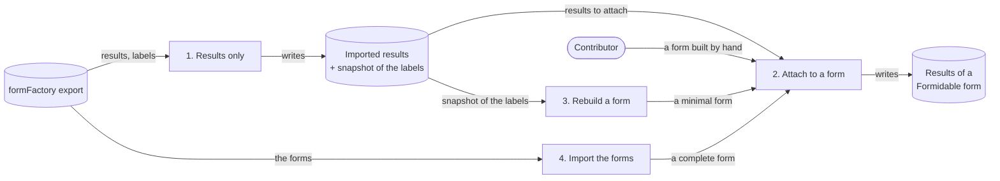
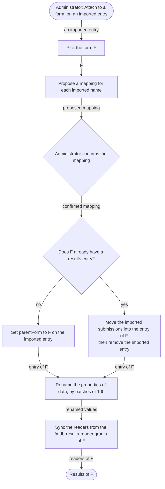

# Importing results from Jahia Forms

Specification of the import of [Jahia Forms](https://github.com/Jahia/forms-core) (`forms-core` 3.x)
submissions into Formidable. Status: **draft for review**. Nothing of it is implemented yet. The open
points are listed at the end, and the spikes there can change parts of the design.

## Goal and iterations

A site that collected submissions with Jahia Forms moves to Formidable without losing them. The work ships
in four iterations: the first one imports the results alone, and the next ones give those results a
Formidable form.



| Iteration | What it delivers |
|---|---|
| 1. Results only | Every submission of every Forms form becomes a Formidable submission, which the Results page lists, filters and exports. No form is created. |
| 2. Attach to a form | An administrator attaches the imported results of one Forms form to a Formidable form. The field names are mapped, and the results take the readers of that form. |
| 3. Rebuild a form | The import creates a minimal form from the snapshot of the labels, then attaches the results to it through iteration 2. |
| 4. Import the forms | The import recreates the complete form with its field types, actions and captcha. It then attaches the results through iteration 2. |

Iterations 3 and 4 are two ways to produce a form. Iteration 2 is the only way to attach results to a
form, whoever built that form.

This document specifies iterations 1 and 2. Iterations 3 and 4 are listed under
[Later iterations](#later-iterations).

## Scope of iteration 1

| In scope | Out of scope |
|---|---|
| Forms 3.x: `forms-core` 3.x, and the three field types of `forms-extended-inputs` | Forms 2.x and older |
| Every submission that the Forms *save to JCR* action saved, files included | The forms themselves, which are iterations 3 and 4 |
| A dry-run report, then the import, which can run again | The drafts that a visitor saved with *save the form for later* (`fcnt:storedForm`), which are not submissions |
| | The pages that place a Forms form (`fcnt:formReference`) |
| | Any deletion in Forms: the import never modifies the source |

## Decisions

| Decision | Why |
|---|---|
| **The import reads the export of the site's `formFactory` node** | The source can live on another instance, or on an instance that is being retired. `forms-core` need not be installed where Formidable runs, so the target never needs the `fcnt:*` types. Iteration 1 reads `formFactory/results` only. |
| **A separate module, `formidable-forms-import`** | The engine knows nothing of Forms. The import is used once per site and then uninstalled. It depends on `formidable-engine`, never the other way round. |
| **An imported value keeps the field name it has in Forms** (`text-input_0_1`, `email-input_0_2`…) | Formidable keys the values of a submission by the node name of the field, as [Save to JCR](save-to-jcr.md) describes, and Forms keys them the same way. Iteration 2 maps these names onto the fields of a form. |
| **The import keeps a snapshot of the labels on each results entry** | Without a form, the Results page has no labels. The snapshot gives the labels until a form is attached. It is also the input of the matching in iteration 2 and of the rebuild in iteration 3. |
| **The submitter's IP address and user name are not imported** | Formidable does not store them for its own submissions, because they are personal data (see [Save to JCR](save-to-jcr.md)). An imported submission must not hold more than a native one. The administration guide states this, so that a site that needs them exports them from Forms first. |
| **Results are written in live** | Results only exist in live in both products. The import writes them there, as `SaveToJcrFormAction` does, and they are never published. |
| **`origin` = `jahia-forms` on an imported submission** | `origin` is the discriminator that [Save to JCR](save-to-jcr.md) documents for "a legacy-forms import". The Results page and the exports can tell an imported submission from a native one. |
| **Before iteration 2, only administrators read the imported results** | The readers of a results entry are synced from the grants of its form, and an imported entry has no form yet. |

## Source model (Forms 3.x)

This section describes what the import reads. Paths are relative to the root of the export file.

### The export file

The export of the `formFactory` node is a Jahia *document view* XML export (`repository.xml`):

- names and values are ISO 9075-encoded: `_x0020_` is a space, and `_x0030_6` is the node name `06`;
- a multi-valued property is one attribute, and spaces separate its values, each value encoded;
- a reference is written `#/<path>`, relative to the export root, as in `parentForm="#/forms/contact-us"`;
- every node carries `jcr:created`, `jcr:createdBy` and `jcr:lastModified`;
- i18n properties live on `j:translation_<lang>` child nodes.

The `forms-core` CND makes `fcnt:formFactory` create both `forms` and `results`, so the export holds the
forms beside their results. Iteration 1 reads `results` only, and `forms` is the source of iteration 4.

### The results

```text
formFactory
├── results
│   └── <formName>
│       ├── labels
│       │   └── <fieldName>
│       ├── actions
│       └── submissions
│           ├── fakeSplittedResultForAreaDisplay
│           └── <MM>
│               └── <dd>
│                   └── <HH>
│                       └── <uuid>
│                           └── <fieldName>
│                               └── <file>
└── forms
```

| Name | Responsibility |
|---|---|
| `<formName>` | The `fcnt:formResults` node. It holds `parentForm`, a weak reference to the `fcnt:form`, then `buildingLang` and `j:translation_<lang>/jcr:title`. |
| `labels/<fieldName>` | A `fcnt:resultLabels` child. It holds `fieldId`, the UUID of the field, and `label` and `choices` per language. |
| `actions` | A copy of the actions of the form. The import ignores it. |
| `submissions` | A `fcnt:submissions` node with `jmix:autoSplitFolders`, split by month, day and hour, with no year level. |
| `fakeSplittedResultForAreaDisplay` | A placeholder. The import skips it. |
| `<uuid>` | A `fcnt:result`. It holds `jcr:created`, the date of the submission, and `origin`, the referer or the request URI. When the form tracks users, it also holds `ip_address` and `jcr:createdBy`. |
| `<fieldName>` | A `fcnt:resultField`. It holds `result`, a string that is always multiple, then `label`, a weak reference to `labels/<fieldName>`, and `optional`. |
| `<file>` | A `jnt:file`, for a file field. |
| `forms` | The `fcnt:formsFolder` that holds the forms. Iteration 1 does not read it. |

Forms writes a value as follows (`SaveToJcrAction` in `forms-core`):

- every value is a string, so one answer is a one-value `result`, and several answers (checkboxes, a
  multiple select) are several values;
- a choice field stores the option key, and the label of the option is in the `choices` of
  `labels/<fieldName>`, a JSON `[{"key","value"}]` per language;
- a date is the moment.js `toISOString()` of the chosen date, a UTC instant: a date picked as 13 August in
  Paris is `2024-08-12T22:00:00.000Z`;
- matrix, rating and country fields store one JSON object as a string, with a `rendererName`
  (`matrixRadios`, `matrixCheckboxes`, `rating`, `country`);
- a file field stores a JSON object `{"url":[],"name":[],"type":[],"size":[],"image":[],"rendererName":"fileUpload"}`,
  and the files themselves are `jnt:file` children of the `fcnt:resultField`;
- a password field stores the placeholder `**********`, never the password;
- empty answers are not stored.

**A renamed field.** The `fcnt:resultField` keeps the name the field had when the visitor submitted, and
its `label` points at the label node of that field. The label node follows the current name of the
field. The import names a value after its label node, so all the submissions of one field land under one
name.

## Iteration 1: results only

### Target model

The import writes the tree that [Save to JCR](save-to-jcr.md) describes, as `SaveToJcrFormAction` writes
it, and adds its own markers:

```text
/sites/<site>/formidable-results
└── <entry>
    └── submissions
        └── <yyyy>
            └── <MM>
                └── <dd>
                    └── <submission>
                        ├── data
                        └── files
                            └── <fieldName>
                                └── <file>
```

| Name | Responsibility |
|---|---|
| `<entry>` | A `fmdb:formResults` with `fmdbimportmix:importedResults`. It is named after the Forms form, or takes the next free name on a clash. [The results entry](#the-results-entry) gives its properties. |
| `<submission>` | A `fmdb:formSubmission` with `fmdbimportmix:importedSubmission`. It is named `submission-<yyyyMMdd-HHmmss>-<xxx>` from the original date, in UTC, as `SaveToJcrFormAction` names it. |
| `data` | The `fmdb:submissionData` node: one string property per field name, multiple for several answers. |
| `files/<fieldName>/<file>` | A `jnt:folder`, a `jnt:folder` and a `jnt:file`, as `SaveToJcrFormAction` writes them. |

### The results entry

| Forms (`fcnt:formResults`) | Formidable (`fmdb:formResults`) |
|---|---|
| `parentForm` | `parentForm` holds the UUID of the Forms form. It points at no node until iteration 2 (spike 1). |
| `buildingLang` | `buildingLang` |
| The node name | The node name, or the next free name in `formidable-results` |
| — | `fmdbimportmix:importedResults`, with `sourceFormIds` (the UUID of the Forms form), `sourceFormName`, `sourceTitle` per language, and `importedLabels` |

`importedLabels` is a JSON string, and it is not indexed. It holds one entry per label node:

- the field name;
- its `fieldId`;
- its label per language;
- its choices per language, each with its key and its label.

The entry gets the ACL that `SaveToJcrFormAction` gives a new entry: the inheritance is broken. It gets
no reader grant, because there is no form to sync the readers from.

### Submissions

| Forms (`fcnt:result`) | Formidable (`fmdb:formSubmission`) |
|---|---|
| `jcr:created` | `jcr:created` holds the date of the submission, which also files the submission under `yyyy/MM/dd` (spike 1). |
| `origin`, the referer or the request URI | `referer` |
| — | `origin` = `jahia-forms` |
| — | `locale` holds the `buildingLang` of the form, because Forms does not record the language of the visitor. |
| — | `timeZone` is not set, because Forms does not record it. |
| `ip_address`, `jcr:createdBy` | Not imported |
| The node name, a UUID | `sourceId` of `fmdbimportmix:importedSubmission` |
| Each `fcnt:resultField` | One property of `data`, named after its label node |
| The `jnt:file` children of a field | `files/<fieldName>/<file>` |

### Values

| Forms value | Formidable value |
|---|---|
| Text, email, number, hidden, textarea | Unchanged |
| A choice key, one or several | Unchanged. The key is the value that an option of a later form must carry. |
| A date, a UTC instant | `yyyy-MM-dd`: the date of the nearest UTC midnight, which is the instant plus 12 hours, truncated to the day |
| Country, a JSON object | Its country code |
| Rating, a JSON object | The rating number |
| Matrix, a JSON object | One line per row, `row: answer(s)` |
| File, a JSON object and the `jnt:file` children | The files are copied under `files/<fieldName>/`, and the JSON is dropped. |
| The password placeholder | Dropped |

The date rule needs no time zone. Forms stored the local midnight of the visitor, so the nearest UTC
midnight is the chosen date for every visitor whose offset is strictly between −12 and +12 hours. A
single time zone for every submission gives the previous day to every visitor east of that zone. With
UTC, the Paris example above becomes 12 August.

### The Results page

An imported entry has no form until iteration 2. The engine reads `fmdbimportmix:importedResults` in two
places:

- the status of the entry is **Imported**, not **Form deleted**;
- the label of a field comes from `importedLabels`, in the language of the user interface, or else in the
  `buildingLang`. A name that the snapshot does not hold shows as it is stored.

These two changes are the only changes that iteration 1 makes to `formidable-engine`.

### Running it

The module adds an administration page for site administrators, in jContent under *Additional* ›
*Import from Jahia Forms*:

1. **Upload.** The administrator uploads the `formFactory` export and chooses the site.
2. **Dry run.** Nothing is written, and the page shows the report.
3. **Import.** The import writes the submissions by batches of 100, and saves each batch on its own. The
   page shows the progress and the final report.

The report gives, per Forms form:

- the number of submissions found, imported and already imported;
- the values converted, dropped (passwords) or not converted (a JSON that does not parse);
- the files, and their total size;
- the name of the entry, when it differs from the name of the Forms form.

### Running it twice

Each imported submission carries `fmdbimportmix:importedSubmission`, whose `sourceId` is the UUID of the
Forms result. The import skips a submission whose source is already imported, wherever that submission
lives in `formidable-results`. An import that stopped half-way therefore runs again as it is.

When the UUID of a Forms form is already in the `sourceFormIds` of an entry, the import adds the new
submissions of that form to that entry. After iteration 2, that entry is the entry of the attached form.

## Iteration 2: attaching the results to a form

An administrator gives the imported results of one Forms form a Formidable form, `F`. The form `F` exists
already: a contributor built it by hand, or iteration 3 or 4 created it.



### The mapping

For each name that the imported submissions hold, the page proposes a field of `F`, in this order:

1. **The same node name.** The match is automatic. A contributor who creates `F` with the system names of
   Forms gets every field matched this way.
2. **The same label.** A field of `F` whose `jcr:title` equals the label in `importedLabels`, in the same
   language, is proposed, and the administrator confirms it.
3. **A choice by hand.** Otherwise, the administrator picks a field of `F`, or keeps the name as it is. A
   kept name shows on the Results page after the known fields, under its raw name.

For a choice field, the page lists the imported keys that no option of the matched field carries as its
value. The import keeps these values as they are.

The page shows the mapping as a dry run before it writes anything.

### What the attachment writes

- **`F` has no results entry.** The imported entry becomes the entry of `F`: `parentForm` is set to `F`,
  and the entry is renamed after `F` when that name is free.
- **`F` already has a results entry.** The imported submissions move into that entry, under
  `yyyy/MM/dd`, and the imported entry is removed. The entry of `F` takes the
  `fmdbimportmix:importedResults` mixin, and the UUID of the Forms form joins its `sourceFormIds`. Several
  Forms forms can attach to one `F` this way.
- **The values.** Every property of `data` whose name the mapping changes is renamed, by batches of 100.
  An attachment that stopped half-way runs again, because the attachment no longer finds a name that it
  already renamed.
- **The readers.** The ACL of the entry is synced from the `fmdb-results-reader` grants of `F`, as for a
  native entry (see [Results permissions](../administration/results-permissions.md)).
- **The marker.** `fmdbimportmix:importedResults` stays on the entry, and `importedLabels` is kept. The
  Results page then reads the labels from `F`.

An attachment cannot be undone. A second attachment of the same entry corrects a wrong mapping, because
it maps the names again.

## Later iterations

### Iteration 3: rebuilding a form from the results

The import creates an unpublished `fmdb:form` from `importedLabels`:

- one field per label node, named after it, so that iteration 2 matches every field by its name;
- the label of the field in each language of the snapshot, or the node name when the snapshot holds no
  label;
- `fmdb:inputText` for a field without choices, and `fmdb:select` with manual options for a field with
  choices. The Forms key becomes the value of the option, and the Forms label becomes its label.

The import then attaches the results through iteration 2, and the contributor completes the form by hand.

### Iteration 4: importing the forms

The import recreates each form from `formFactory/forms`: its steps, field types, labels, placeholders,
help texts, required rule and messages, choices, captcha, and save and email actions. It then attaches the
results through iteration 2. This iteration needs its own specification. Four points are known already:

- A password field is not recreated. Forms masked the password in storage and in the mail, but a
  Formidable text field would store and mail it in clear.
- A country field needs the `country` options source, and only the samples module ships that source.
- A Forms redirect action maps onto the [redirect action](redirect-action.md) once that action ships.
- The send-to-submitter action maps onto a notification action whose recipient the contributor fills in.

## Tests

- **Unit tests.** They cover the reader (ISO 9075 decoding, multi-values, references), each value
  conversion, the snapshot of the labels and the mapping proposal of iteration 2. The date rule is tested
  at the offsets −11, −4, 0, +2, +9 and +11 hours. The fixtures are the anonymised sample exports.
- **A Cypress spec for iteration 1.** The spec uploads the sample export and checks the dry-run report.
  After the import, the spec checks the count, the values, the dates, the **Imported** status, the labels
  from the snapshot and the imported origin on the Results page. A second run of the import must
  duplicate nothing.
- **A Cypress spec for iteration 2.** The spec attaches the imported results to a form with three fields:
  one with the same node name, one with the same label, and one that the administrator picks. The spec
  checks the labels, the renamed values and the readers, then attaches a second entry to the same form
  and checks the merge.

## Open points

| # | Point | Effect |
|---|---|---|
| Spike 1 | Can a session write `parentForm`, a mandatory weak reference, with the UUID of a node that does not exist? Can it set `jcr:created` on a new `fmdb:formSubmission`, as the Jahia import does? | If the first fails, the entry needs a placeholder target, or `parentForm` becomes optional. If the second fails, an `importedAt` property holds the original date, and the Results page and the split read it when it is present. |
| Spike 2 | Which value does an `fmdb:inputDate` submit and store: `yyyy-MM-dd`? | The date conversion |
| 3 | Who reads the results before iteration 2: a role granted on an imported entry, or administrators only? | Permissions |
| 4 | Before iteration 2, does the Results page show the label of a choice from `importedLabels`, or the key? | Iteration 1 |
| 5 | The sample exports hold real email addresses, so they must be anonymised before they are committed as fixtures. | Tests |
