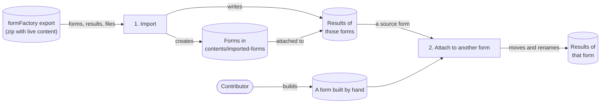
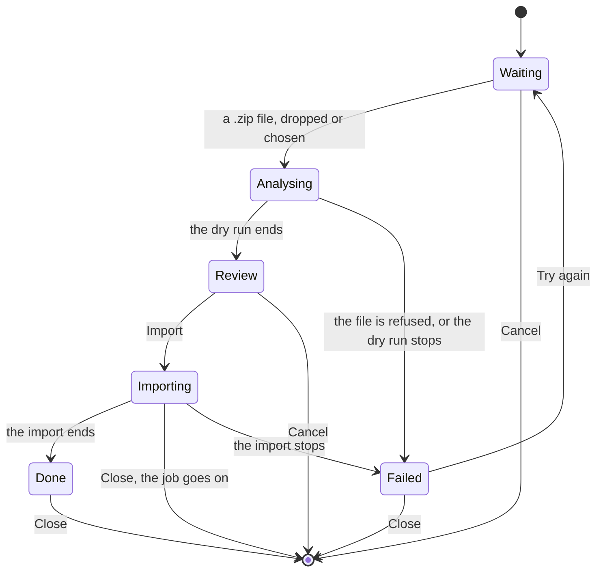
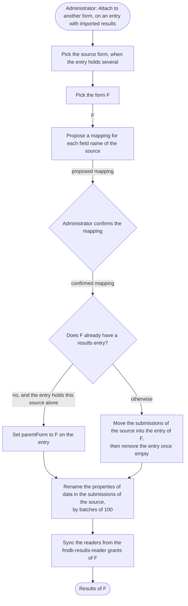

# Importing forms and results from Jahia Forms

Specification of the import of [Jahia Forms](https://github.com/Jahia/forms-core) (`forms-core` 3.x) forms
and submissions into Formidable. Status: **draft for review**. Nothing of it is implemented yet. The open
points are listed at the end, and the spikes there can change parts of the design.

## Goal and iterations

A site that collected submissions with Jahia Forms moves to Formidable without losing them. The import
reads the export of the site's `formFactory` node, recreates each Forms form as a Formidable form in a
content folder of the site, and writes the submissions of that form as the results of the new form. The
work ships in two iterations.



| Iteration | What it delivers |
|---|---|
| 1. Import | Every Forms form becomes an unpublished Formidable form in the `imported-forms` content folder of the site, with system names generated from the labels, the field types Formidable has, the labels, placeholders, help texts, required rules, choices and actions that map. Every submission the Forms *save to JCR* action stored becomes a submission of that form, files included. The Results page lists, filters and exports them as native results, with the labels of the form once it is published. |
| 2. Attach to another form | An administrator moves the imported results of one Forms form onto another Formidable form, built by hand or reworked: the field names are mapped and renamed, and the results take the readers of that form. |

No result ever exists without a form: iteration 1 creates the form before it writes the first submission,
so the Results page, the exports and the statuses need no change for imported results. The import never
publishes, though, and the page resolves a form through its live reference (`FormResultsApp.tsx`): until a
contributor publishes an imported form, its entry shows as **Unpublished**, and the page and the exports
head their columns with the system names of the fields. This is why the import gives each field a readable
system name, generated from its label (`your-first-name`, not `text-input_0_1`), and why the final report
invites to publish the forms.

## Scope

| In scope | Out of scope |
|---|---|
| Forms 3.x: the forms and the field types of `forms-core` 3.x, and the field types of `forms-extended-inputs` that submit a value (image checkboxes, accept terms) | Forms 2.x and older |
| Every submission that the Forms *save to JCR* action saved, files included | The drafts that a visitor saved with *save the form for later* (`fcnt:storedForm`), which are not submissions |
| An import started from the Results page of the target site: a dry run and its report, then the import, which can run again | The pages that place a Forms form (`fcnt:formReference`): the contributor places the new form |
| The forms, as far as Formidable has an equivalent: what has none is reported, never silently dropped | Any deletion in Forms: the import never modifies the source |
| | Conditional logic, prefills and the layout of the Forms form: reported, rebuilt by hand |

## Decisions

| Decision | Why |
|---|---|
| **The import reads the zip export of the site's `formFactory` node, taken with its live content** | The source can live on another instance, or on an instance that is being retired, so `forms-core` need not be installed where Formidable runs. The zip is the only export that carries the three things the import needs: the results, which Forms writes in live only; the `jcr:uuid` of every node, which keys the forms; and the uploaded files. See [The export file](#the-export-file). |
| **The import lives in `formidable-engine`, behind a setting** | No module to install, then to keep installed or to uninstall while its markers stay on the nodes. The markers are generic, owned by the engine and written for any source system ([CND module ownership](cnd-module-ownership.md)). Only the reader of the Forms export and the conversion of its forms and values know Forms, in their own package of the engine. |
| **Every Forms form becomes a Formidable form before its results are written** | A results entry without a form has no labels, no readers and no status, and supporting that state would cost a placeholder form reference, an **Imported** status, a snapshot of the labels rendered by the Results page and the exports. Creating the form first removes all of it: imported results are native results. |
| **The forms land in one content folder, `contents/imported-forms`** | Formidable forms are contents of the site (`/sites/<site>/contents/...`). One folder keeps the imported forms apart from the forms built by hand, where contributors find them in jContent, review them, move them and publish them. |
| **A field gets a system name generated from its label**, `your-first-name` for "Your First name", not the Forms name `text-input_0_1` | Formidable keys the values of a submission by the node name of the field ([Save to JCR](save-to-jcr.md)), and that name heads the columns of the Results page and of the exports whenever the form does not resolve in live, so a Forms name there reads as noise. The name is generated as the Content Editor generates a system name from a title, the rule a contributor gets anyway. The import writes `data` itself, so the new names cost no rename, and each field remembers its Forms identity for the later runs. See [The system names](#the-system-names). |
| **The label of a field is its title, else its placeholder, else its name** | Forms often leaves the title of a field empty and shows the placeholder as its only text: in the sample export, eight of the nine fields have an empty title, and their placeholders read "Your First name\*", "Votre prénom\*". See [The labels](#the-labels). |
| **The submitter's IP address and user name are not imported** | Formidable does not store them for its own submissions, because they are personal data (see [Save to JCR](save-to-jcr.md)). An imported submission must not hold more than a native one. The administration guide states this, so that a site that needs them exports them from Forms first. |
| **The forms are created unpublished, the results are written in live** | A contributor reviews a form, completes what the import reported, then publishes it: the import never publishes. Until then the Results page shows the entry as **Unpublished**, with the system names of the fields as columns, as for any native form that is not published. Results only exist in live in both products: the import writes them there, as `SaveToJcrFormAction` does, and they are never published. |
| **`origin` = `jahia-forms` on an imported submission** | `origin` is the discriminator that [Save to JCR](save-to-jcr.md) documents for "a legacy-forms import". The Results page and the exports can tell an imported submission from a native one. |
| **A Forms form is recognised by its `jcr:uuid` and by the `jcr:uuid` of its results node, a field by its `jcr:uuid`, a submission by its node name** | All of them are in the zip export. A later run finds the form it created, the field each value belongs to and the submissions it wrote, and adds only what is missing. The form keeps both of its keys because either can be missing: the form's, once Forms deleted the form; the results node's, while the form was never published. See [Running it twice](#running-it-twice). |
| **The import starts from the Results page, behind a setting** | An **Import** button in the toolbar of the Results page, off by default, opens a dialog that takes the export, shows the report of a dry run, then imports into the current site. See [Running it](#running-it). |

## Source model (Forms 3.x)

This section describes what the import reads. Paths are relative to the root of the export.

### The export file

The export is taken in the **Repository explorer**: open the site, right-click its `formFactory` node,
choose **Export**, then **Export Zip with live content**. The zip holds two Jahia *document view* files,
`repository.xml` and `live-repository.xml`, and the binaries of the files under them, each at
`live-content/<path of the file node>/<file name>`, the path being relative to the parent of the exported
node (`DocumentViewExporter.buildBinaryPathInZip`). In the sample export
the two files are identical: the forms come from the edit workspace, the results from live, and each
live-only node is marked `j:originWS="live"`. The import reads `live-repository.xml` when the zip has one,
`repository.xml` otherwise.

In these files:

- node names are ISO 9075-encoded: `_x0020_` is a space, and `_x0030_6` is the node name `06`;
- a multi-valued property is one attribute, and spaces separate its values, each value encoded the same
  way (`result="+44_x0020_7911_x0020_123456"` in the sample); a single value is written as it is
  (`jsonValue="Your First name*"`), so the import decodes names and multi-values only;
- every node carries `jcr:uuid`, `jcr:created`, `jcr:createdBy` and `jcr:lastModified`;
- a reference is nonetheless written as a path, `#/<path>` relative to the export root, as in
  `parentForm="#/forms/contact-us"`;
- i18n properties live on `j:translation_<lang>` child nodes.

The other two exports hold less, and the dry run refuses them with the reason, and the procedure above:

- **Export XML**, a `repository.xml` alone: it holds the results, but no `jcr:uuid` and no binary, so the
  files of the submissions are lost;
- **Export Zip**, without live content: it holds the forms and no result (spike 3 confirms it). The same
  message serves a zip taken from jContent, which reads the edit workspace only, and the export of a
  single form from the Forms builder.

The administration guide gives the same procedure, with the two screens.

### The forms

```text
formFactory
└── forms
    └── <formName>
        ├── j:translation_<lang>
        ├── step-<n>
        │   └── <fieldName>
        │       ├── j:translation_<lang>
        │       ├── placeholder, helptext, inputsize, rows, choices…
        │       ├── validations
        │       │   └── <rule>
        │       ├── prefills
        │       └── logics
        └── actions
            └── <action>
```

| Name | Responsibility |
|---|---|
| `<formName>` | The `fcnt:form`. It holds `jcr:title` per language, `buildingLang`, `afterSubmissionText`, `cssClass`, `numberOfSteps`, and the mixins `fcmix:displayCaptcha`, `fcmix:trackUser`, `fcmix:formSavable`, `fcmix:submissionConstraints`. |
| `step-<n>` | A `fcnt:step`, with `stepNumber`. A form has at least one. |
| `<fieldName>` | A field definition: one of the `fcnt:*Definition` types, all with the `fcmix:definition` mixin. It holds `jcr:title` per language, often empty, and `choiceField`, the names of the child option nodes that hold its choices. |
| Its option children | `fcnt:definitionOptions` nodes, named after the option: `placeholder`, `helptext`, `inputsize`, `rows`, `choices`… A `fcnt:definitionOptionsTranslatable` holds its `jsonValue` per language. The `choices` of a choice field are a JSON `[{"key","value"}]` per language. |
| `validations/<rule>` | A rule: `fcnt:requiredValidation`, `emailValidation`, `rangeValidation`, `rangeLengthValidation`, `regexValidation`, `fileValidation`, `fileNumberValidation`, `equalToValidation`… each with a `message` per language. |
| `prefills`, `logics` | The jExperience prefills and the conditional logic. The import reports them and rebuilds neither. |
| `actions/<action>` | One of `fcnt:saveToJcrAction`, `sendEmailAction`, `sendEmailToSubmitterAction`, `redirectToAPageAction`, `redirectToUrlAction`, with its options as children. |

### The results

```text
formFactory
└── results
    └── <formName>
        ├── labels
        │   └── <fieldName>
        ├── actions
        └── submissions
            ├── fakeSplittedResultForAreaDisplay
            └── <MM>
                └── <dd>
                    └── <HH>
                        └── <mm>
                            └── <ss>
                                └── <uuid>
                                    └── <fieldName>
                                        └── <file>
```

| Name | Responsibility |
|---|---|
| `<formName>` | The `fcnt:formResults` node. It holds `parentForm`, a weak reference to the `fcnt:form` that the export writes as a path, then `buildingLang` and `j:translation_<lang>/jcr:title`. |
| `labels/<fieldName>` | A label node, a `fcnt:definitionOptionsTranslatable` under the `fcnt:resultLabels` node `labels`. It holds `fieldId`, the UUID of the field, and `label` and `choices` per language. Forms refreshes it on each publication of the form, so it follows the current name of the field. |
| `actions` | A copy of the actions of the form. The import ignores it. |
| `submissions` | A `fcnt:submissions` node with `jmix:autoSplitFolders`, with no year level. The current `forms-core` 3.x splits by month, day, hour, minute and second (`FormSubmission`); older 3.x releases stopped at the hour, as the sample export does. The import walks the `fcnt:splittedResult` folders at any depth and takes every `fcnt:result` it finds. |
| `fakeSplittedResultForAreaDisplay` | A placeholder. The import skips it. |
| `<uuid>` | A `fcnt:result`. It holds `jcr:created`, the date of the submission, and `origin`, the referer or the request URI. When the form tracks users, it also holds `ip_address` and `jcr:createdBy`. |
| `<fieldName>` | A `fcnt:resultField`. It holds `result`, a string that is always multiple, then `label`, a weak reference to `labels/<fieldName>`, and `optional`. |
| `<file>` | A `jnt:file`, for a file field. Its binary is in the zip. |

Forms writes a value as follows (`SaveToJcrAction` in `forms-core`):

- every value is a string, so one answer is a one-value `result`, and several answers (checkboxes, a
  multiple select) are several values;
- a choice field stores the option key, and the label of the option is in the `choices` of the field
  and of its label node;
- a date is the moment.js `toISOString()` of the chosen date, a UTC instant: a date picked as 13 August in
  Paris is `2024-08-12T22:00:00.000Z`;
- the matrix, rating and country fields of `forms-core` store one JSON object as a string, with a `rendererName`
  (`matrixRadios`, `matrixCheckboxes`, `rating`, `country`), shaped as their directives submit it
  (`forms-core/src/main/resources/fcnt_*Definition/js`): a matrix keeps one key per row beside the renderer
  name, `{"Price":"Good","Service":"Poor","rendererName":"matrixRadios"}`; a rating keeps its number under
  `value`, `{"rendererName":"rating","css":"fa-star rated","type":"…","value":4}`; a country keeps its code
  under `country.key`, `{"country":{"key":"FR","name":"France"},"rendererName":"country"}`;
- an accept-terms box (`forms-extended-inputs`) stores its `yes` label when ticked, "Accepted" by default,
  and its `no` label when not, "Not Accepted", in the language of the form (`ng-false-value="'{{input.no}}'"`);
- a file field stores a JSON object `{"url":[],"name":[],"type":[],"size":[],"image":[],"rendererName":"fileUpload"}`,
  and the files themselves are `jnt:file` children of the `fcnt:resultField`;
- a password field stores the placeholder `**********`, never the password;
- empty answers are not stored.

**A renamed field.** The `fcnt:resultField` keeps the name the field had when the visitor submitted, and
its `label` points at the label node of that field, which follows the current name and holds its
`fieldId`. The import names a value after the field it created for that `fieldId`, so all the submissions
of one field land under one name, the system name of the field in the recreated form.

## Iteration 1: import

### Target model

```text
/sites/<site>
├── contents
│   └── imported-forms
│       └── <formName>
│           ├── fields
│           │   └── <fieldName>
│           └── actions
│               └── <action>
└── formidable-results
    ├── <entry>
    │   └── submissions
    │       └── <yyyy>
    │           └── <MM>
    │               └── <dd>
    │                   └── <submission>
    │                       ├── data
    │                       └── files
    │                           └── <fieldName>
    │                               └── <file>
    └── import-jobs
        └── <job>
```

| Name | Responsibility |
|---|---|
| `imported-forms` | A `jnt:contentFolder` titled *Imported from Jahia Forms*, created by the first import when the site has none. |
| `<formName>` | A `fmdb:form` with `fmdbmix:importedForm`, named after the Forms form, or the next free name in the folder. [The forms](#the-forms-1) gives its content. |
| `fields/<fieldName>` | One field per Forms field, named as [The system names](#the-system-names) says, with `fmdbmix:importedField`. A form with several steps holds one `fmdb:step` per `fcnt:step` under `fields`, and the fields of that step under it. |
| `<entry>` | The `fmdb:formResults` of the new form, as `SaveToJcrFormAction` creates it: named after the form, or the next free name, `parentForm` set to the form, `buildingLang` from Forms, the ACL inheritance broken. It carries `fmdbmix:importedResults`. |
| `<submission>` | A `fmdb:formSubmission` with `fmdbmix:importedSubmission`. It is named `submission-<yyyyMMdd-HHmmss>-<xxx>` from the original date, in UTC, as `SaveToJcrFormAction` names it. |
| `data` | The `fmdb:submissionData` node: one string property per field name, multiple for several answers. |
| `files/<fieldName>/<file>` | A `jnt:folder`, a `jnt:folder` and a `jnt:file`, as `SaveToJcrFormAction` writes them. |
| `import-jobs/<job>` | The jobs of [Running it](#running-it). |

### The forms

Each `fcnt:form` of the export becomes one `fmdb:form`:

| Forms | Formidable |
|---|---|
| `jcr:title` per language | `jcr:title` per language, or the node name when every title is empty |
| `afterSubmissionText` | `submissionMessage` |
| One `fcnt:step` | The fields directly under `fields` |
| Several `fcnt:step` | One `fmdb:step` per step, titled after it, in the order of `stepNumber` |
| A `fieldsetStart` and its `fieldsetEnd` | One `fmdb:fieldset`, titled after the start, holding the fields between them |
| The `button` definitions | Not fields: the title of a button fills `submitBtnLabel`; the three labels of a `buttonTriple` are part of spike 4 |
| `fcmix:displayCaptcha` | The form's captcha, when the instance has a captcha configured; reported otherwise |
| `fcmix:trackUser` | Nothing: Formidable does not track the submitter |
| `fcmix:formSavable`, `fcmix:submissionConstraints` | Nothing, reported: Formidable has neither *save for later* nor submission constraints |
| `cssClass`, the layout | Dropped |

A form whose results the export holds but which `forms` no longer holds, because it was deleted in Forms,
is built from its label nodes alone: one `fmdb:inputText` per label node, or one `fmdb:select` with the
choices of the label node when it has some, titled and named from the `label` of the label node by the
same rules as the other fields. Its title is the title of the `fcnt:formResults`, and the `jcr:uuid` of
that node is its only key (see [Running it twice](#running-it-twice)).

### The fields

Each field definition becomes one field of the type below, named as [The system names](#the-system-names)
says. The third column gives what the import writes into `data` for that field, from the Forms value.

| Forms definition | Formidable field | Value |
|---|---|---|
| `inputDefinition` | `fmdb:inputText` | Unchanged |
| `phoneDefinition` | `fmdb:inputText`, reported: Formidable has no phone field | Unchanged |
| `emailDefinition` | `fmdb:inputEmail` | Unchanged |
| `textAreaDefinition` | `fmdb:textarea`, with `rows` | Unchanged |
| `numberDefinition` | `fmdb:inputNumber` | Unchanged |
| `hiddenDefinition` | `fmdb:inputHidden`, with its `value` | Unchanged |
| `passwordDefinition` | Not recreated, reported: Forms masked the password in storage and in the mail, but a Formidable text field would store and mail it in clear | Dropped, with the placeholder `**********` |
| `selectBasicDefinition`, `selectMultipleDefinition` | `fmdb:select`, `multiple` for the second, with manual options | The option key, one or several, unchanged |
| `multipleRadiosDefinition`, `multipleRadiosInlineDefinition` | `fmdb:radio` with manual options | The option key |
| `multipleCheckBoxesDefinition`, `multipleCheckBoxesInlineDefinition` | `fmdb:checkbox` with manual options | The option keys |
| `switchDefinition` | `fmdbext:switch`, its `onLabel` and `offLabel` from the `textOn` and `textOff` of the switch; without the extended inputs, `fmdb:radio` with the two options `true` and `false`, labelled with those texts | `true` or `false`, unchanged |
| `datePickerDefinition`, `simpleDateDefinition` | `fmdb:inputDate` | `yyyy-MM-dd`: the instant plus 12 hours, truncated to the UTC day (below) |
| `countryListDefinition` | `fmdb:select` on the `country` options source when the instance declares one (see [Choice field options sources](choice-field-options-sources.md)), else with the choices of the label node | The country code, the `key` of the `country` object in the JSON |
| `ratingDefinition` | `fmdbext:rating`, its `maxValue` from the `max` of the Forms rating; without the extended inputs, `fmdb:inputNumber` | The `value` of the rating JSON |
| `matrixRadiosDefinition`, `matrixCheckBoxesDefinition` | `fmdb:textarea`, reported: Formidable has no matrix | One line per row of the JSON, `row: answer(s)`, in the order of the text |
| `fileUploadDefinition` | `fmdb:inputFile`; `accept` from the type groups a `fileValidation` selects (`image`, `audio`, `video`, `pdf`, `text` have an `accept` equivalent, `all` restricts nothing, `doc` is a regular expression over the office types, reported); `multiple` when the `filenumber` of a `fileNumberValidation` is not 1 | The files are copied under `files/<fieldName>/`, and the JSON is dropped |
| `acceptTermCheckboxDefinition` (`forms-extended-inputs`) | `fmdbext:consent`, its `statement` from the `termsLabel` of the box, the `{LICENSE}` placeholder turned into its `link`, else from the title; without the extended inputs, `fmdb:checkbox` with one option, the accepted value | `true` when the answer is the `yes` label of the box, nothing when it is the `no` label, for the consent and for the checkbox alike; any other text is kept, with a note |
| `imageCheckboxDefinition` (`forms-extended-inputs`) | `fmdb:checkbox` with manual options, the images dropped | The option keys |
| `contentDisplayDefinition` (`forms-extended-inputs`) | Not recreated, reported: it displays a content, submits nothing | — |
| Any other type | `fmdb:inputText`, reported | Unchanged |

The `fmdbext:*` types belong to `formidable-extended-inputs`. The import uses them when the repository
registers the type, as the migrations test a type before they query it, and falls back on the
`formidable-elements` type of the row otherwise, with a line in the report.

For every field:

- `jcr:title` per language follows [the label rule](#the-labels);
- `placeholder` and `helptext` become `placeholder` and `helpText`; a select, which has no placeholder,
  takes it as its `optionsEmptyLabel`; a setting the target type does not declare is reported, never
  written, so that the writer meets no constraint violation;
- a `requiredValidation` sets `required`, and its message becomes `msgValueMissing`;
- a `rangeLengthValidation` sets `minLength` and `maxLength`, a `rangeValidation` sets `minValue` and
  `maxValue`, a `regexValidation` sets `pattern`, each with its message in the slot of the type
  (`msgTooShort` and `msgTooLong`, `msgRangeUnderflow` and `msgRangeOverflow`, `msgPatternMismatch`); an
  `emailValidation` on an e-mail field fills `msgTypeMismatch`. A rule the field type cannot carry,
  and `equalToValidation`, are reported;
- a manual option is written as Formidable stores it, `{"value","label","selected"}` per language: the Forms
  key becomes the value, so that the imported values match, and the Forms label becomes the label;
- `prefills` and `logics` are reported, with the names of the fields they touch, and nothing is written for
  them. `inputsize` is dropped.

**The date rule** needs no time zone. Forms stored the local midnight of the visitor: for a visitor at the
offset `o`, the instant is the chosen day minus `o`. Adding 12 hours and truncating gives back the chosen
day for every offset above −12 and up to +12 hours. The Paris example above, at +2, becomes 13 August
again. A single time zone for every submission would instead give the previous day to every visitor east
of that zone. The rule fails at +13 and +14, the offsets of New Zealand in summer, Tonga, Samoa and
Kiribati: their visitors get the previous day. The offsets in use span 26 hours, more than a day, so no
rule without a time zone covers them all. The administration guide states this limit.

### The labels

The title of a recreated field, per language of the Forms form, is the first text found among:

1. the `jcr:title` of the field definition;
2. the `label` of its label node under `results/<formName>/labels`, which Forms filled from the same
   title at the last publication, and which may hold a text the definition has lost;
3. its `placeholder`, without a trailing `*` and the spaces before it: Forms contributors mark a required
   field this way in the placeholder, and Formidable renders its own mark on a required field;
4. the node name of the field.

In the sample export, `text-area_0_4` gets "Your Enquiry" / "Votre demande" from its title, and the eight
other fields get "Your First name", "Votre prénom", "Your Email Address", "Votre courriel"… from their
placeholders. The placeholder itself is kept as the field's placeholder, with its `*`.

The label of an option is the Forms label of the choice, per language, and its value the Forms key.

### The system names

The node name of a recreated field is generated from its label in the `buildingLang` of the form, as the
Content Editor generates a system name from a title (`JCRContentUtils.generateNodeName`): lower case,
accents removed, spaces and punctuation turned into hyphens, cut at 128 characters, the default of
`jahia.jcr.maxNameSize`. In the sample export,
`contact-us` gets `your-first-name`, `your-last-name`, `your-email-address`, `your-telephone-number` and
`your-enquiry`, and `newsletterregistration` gets `firstname`, `lastname` and `enter-your-email-here`:
the rule gives what the contributor would have typed, no more, and the contributor renames what reads
badly.

The name is unique in the form: a second field with the same label takes the next free name, `email-1`.
A field without any label keeps its Forms name, `text-input_0_1`. A generated name that is a request
parameter the submission pipeline reads for itself (`fid`, `lang`) takes a suffix too.

Each field carries `fmdbmix:importedField`, with the `jcr:uuid` of the Forms field as `sourceId` and its
Forms node name as `sourceName`: the mapping from the Forms names to the new ones lives on the form, and a
later run reads it there. The values of a submission are written under the new names directly, so no
rename ever runs. The Results page and the exports show these names as column heads while the form is not
published, which is the reason to generate them: `text-input_0_1` would stand there instead.

### The actions

| Forms action | Formidable action |
|---|---|
| `saveToJcrAction` | `fmdb:save2jcrAction`, so that the form keeps saving once published. A form that Forms did not save gets no action: the imported results need the entry, which the import creates itself, not the action, and a form that starts keeping the personal data of its visitors must be a choice of the site, not of the import. The report says: "Forms did not save this form's submissions; add *Save to JCR* to keep saving them." |
| `sendEmailAction` | `fmdb:emailNotificationAction`, with the `to` recipients, the sender and the subject of the Forms action. The CC and BCC addresses are reported, not carried: Formidable sends one message to one list, where they would be shown to the other recipients. The body is reported, because the two templates differ |
| `sendEmailToSubmitterAction` | `fmdb:emailNotificationAction` with no recipient, reported: Formidable has no action that writes to the submitter |
| `redirectToAPageAction`, `redirectToUrlAction` | Reported, with the target, until the [redirect action](redirect-action.md) ships |
| Any other type | Reported |

### The submissions

| Forms (`fcnt:result`) | Formidable (`fmdb:formSubmission`) |
|---|---|
| `jcr:created` | `jcr:created` holds the date of the submission. The property is protected, and `JCRNodeWrapper.addNode(name, type, uuid, created, createdBy, lastModified, lastModifiedBy)`, what the Jahia import calls, sets it. The auto-split listener places only the direct children of `submissions`, so the import creates the `yyyy/MM/dd` folders itself and adds the submission under them, where the listener leaves it (verified on 8.2, spike 1). |
| `origin`, the referer or the request URI | `referer` |
| — | `origin` = `jahia-forms` |
| — | `locale` holds the `buildingLang` of the form, because Forms does not record the language of the visitor. |
| — | `timeZone` is not set, because Forms does not record it. |
| `ip_address`, `jcr:createdBy` | Not imported |
| The node name, a UUID | `sourceId` of `fmdbmix:importedSubmission` |
| Each `fcnt:resultField` | One property of `data`, named after the field created for the `fieldId` of its label node, converted as [the fields](#the-fields) say. A value whose field the form no longer holds, because a contributor deleted it between two runs, keeps its Forms name. |
| The `jnt:file` children of a field | `files/<fieldName>/<file>`, under the same name, with the binary read from the zip |

### Content model

The engine declares the import's types beside the results types, in `definitions.cnd`. None of them names
Forms: `sourceSystem` does.

```cnd
// On a form the import created. sourceId is the jcr:uuid of the Forms form, sourceResultsId the
// jcr:uuid of its fcnt:formResults; a later run looks a form up by either, hence both indexed. At least
// one is set.
[fmdbmix:importedForm] mixin
 - sourceSystem (string) mandatory indexed=no
 - sourceId (string)
 - sourceResultsId (string)
 - sourcePath (string) indexed=no

// On a field the import created: the Forms field it stands for, and the Forms name its values had.
[fmdbmix:importedField] mixin
 - sourceId (string) mandatory indexed=no
 - sourceName (string) mandatory indexed=no

// On a results entry that holds imported submissions, of one source form or several after iteration 2.
// mappings holds, per source form, the mapping that an attachment applied (one JSON string each).
[fmdbmix:importedResults] mixin
 - sourceSystem (string) mandatory indexed=no
 - sourceFormIds (string) multiple indexed=no
 - mappings (string) multiple indexed=no

// On an imported submission. sourceId is what a later run looks up, hence indexed. sourceFormId is the
// key of its source form: the form's sourceId, or its sourceResultsId when Forms had deleted the form.
[fmdbmix:importedSubmission] mixin
 - sourceId (string) mandatory
 - sourceFormId (string) mandatory indexed=no

[fmdb:importJobs] > jnt:content, jmix:accessControlled
 + * (fmdb:importJob) = fmdb:importJob

[fmdb:importJob] > jnt:content
 - state (string) indexed=no
 - report (string) indexed=no
 + file (jnt:file) = jnt:file
```

`fmdb:resultsFolder` gets one named child, `import-jobs` (`fmdb:importJobs`), for the jobs of
[Running it](#running-it). The name is quoted in the CND: the parser of the Jahia Maven plugin breaks an
unquoted name at its hyphen. Its ACL inheritance is broken, as on a results entry, so the jobs and their
files stay with the administrators.

### The readers

The entry gets the ACL that `SaveToJcrFormAction` gives a new entry, synced from the `fmdb-results-reader`
grants of the form. A form the import just created has none, so only administrators read its results
until a contributor grants the role on the form, as for any form (see
[Results permissions](../administration/results-permissions.md)). The final report says so.

### Running it

The import starts from the toolbar of the Results page, next to **Export**, **Delete** and **Refresh**.

**The setting.** The engine gets a sixth configuration file, `org.jahia.modules.formidable.formsImport.cfg`,
with the conventions of the other five (see the [administration guide](../administration/configuration.md)):

| Setting | Default | Effect |
|---|---|---|
| `importButtonEnabled` | `false` | Shows the **Import** button on the Results page of every site |
| `maxFileSizeMb` | `200` | The largest export the dialog accepts |

The button is off by default: the import is used once per site, and an administrator turns it on for that
time, then off again. The button shows after **Refresh** when the setting is on and the user is an
administrator of the current site; the endpoint checks both again.

**The site.** The import writes into the site whose Results page is open. A `formFactory` export belongs
to one site, and its paths are relative to its root, so nothing in the file names a site: the administrator
opens the Results page of the target site, which may differ from the source site.

**The dialog.** The **Import** button carries Moonstone's `Upload` icon. It opens a dialog that runs a dry
run first, then the import:



| State | What the dialog shows |
|---|---|
| Waiting | A drop zone that takes a `.zip` file by drag and drop, and a **Choose a file** button that opens the file picker. Another type, or a file above `maxFileSizeMb`, is refused in the dialog with its reason. The dialog opens in this state unless the site has an import that is running, or that ended and whose report nobody has read: it then opens in that job's state. |
| Analysing | The file name and a spinner, while the server reads the export and writes nothing. |
| Review | The report of the dry run (below), and two buttons: **Import** and **Cancel**. A report with nothing to import (every form and every submission already imported) shows **Close** alone. While another import runs on the site, **Import** is refused with that reason. |
| Importing | The file name and a spinner. The dialog can be closed: the job goes on without it, and the dialog, opened again on this site, shows the running import, or its end state once it has ended. |
| Done | Moonstone's `Check` icon, then the final report, which ends with the invitation to publish the forms. **Close** refreshes the list of entries. |
| Failed | The reason, as the server gives it (an export without results, a broken zip, a lost connection), then **Try again** and **Close**. |

**The server.** The file is uploaded once, by a `POST` to an endpoint of the engine on the current site.
It is stored in the repository, not on the disk of one server: a `fmdb:importJob` node under
`formidable-results/import-jobs`, in live, holds the file and the state of the job. Each phase is a job of
Jahia's **persistent** scheduler, the one backed by the database (`SchedulerService`), not the RAM one,
which would lose both the uniqueness and the recovery below: the upload starts the dry run, and **Import**
starts the import on the same node. The endpoint answers each start with the job's identifier, and the
dialog asks for its state every second until it ends, so that a long phase never runs into a proxy
timeout.

The reader is a streaming XML parser (StAX), because an export of 200 MB does not fit in memory as a
document, and it is read twice, by the dry run and by the import. It reads the two `repository.xml`
entries of the zip and the binaries that the submissions reference, nothing else, with external entities
disabled and each entry bounded in size.

On a cluster, the persistent scheduler runs on the processing server only, so the jobs run there, while
the upload, the poll and **Import** reach whichever server the load balancer picks. All of them read the
file and the state from the repository, so no server needs to be the one that took the upload.

**One import at a time per site.** The check on `sourceId` happens before a batch is written, so two
imports of overlapping exports, from two tabs or two administrators, could both find a submission absent
and both write it. The import job is therefore scheduled under one name per site,
`forms-import-<siteKey>`: the persistent scheduler holds one job of a name at a time, across the cluster,
so the second **Import** finds the job and is refused, in the review state, with its reason ("another
import is running on this site"). A processing server that stops mid-import leaves its job in the
database; the job requests recovery, so it runs again when that server is back, and the import then finds
the forms and the submissions already written by their `sourceId`. Until then the job reads as running,
in the dialog of anyone who opens it on that site. Dry runs write nothing, so each runs under its own
name, side by side.

The import writes the forms first, then the submissions by batches of 100, and saves each batch on its
own. When a phase ends, the job node keeps its end state and its report. A dry run keeps its file for the
import that may follow; the import drops the `file` child when it ends, because it has served. The dialog
reads the report from the node, then **Close** removes the node, so a reload, or a second administrator,
still finds the report until someone has read it. A node nobody read is removed one hour after its end, as
is a dry run that no import followed; **Cancel** removes the node too. A running import is never removed.

The dry run and the import read the export the same way, so the final report gives the figures of the dry
run, except for what another import wrote in between.

The report gives, per Forms form:

- the form it creates, with its name in `imported-forms`, or the form it found from an earlier run;
- its fields, with the system name and the type each one takes, and the fields, rules, actions and
  settings that are reported because Formidable has no equivalent;
- the number of submissions found, to import and already imported;
- the values converted, dropped (passwords) or not converted (a JSON that does not parse);
- the files, and their total size.

The final report ends with the next step: the forms are in `imported-forms`, unpublished; until a form is
published, its entry shows as **Unpublished** on the Results page, with the system names as columns; a
contributor reviews each form, completes what the report lists, then publishes it.

### Running it twice

Each form the import creates carries `fmdbmix:importedForm`, with the `jcr:uuid` of the Forms form as
`sourceId` and the `jcr:uuid` of its `fcnt:formResults` as `sourceResultsId`, each when the export holds
it, and each submission carries `fmdbmix:importedSubmission`, whose `sourceId` is the UUID of the Forms
result. A later run looks a form up by either key, because an export can lose one of them: a form deleted
in Forms between two exports keeps only its results node, which the second run matches on
`sourceResultsId` instead of creating an empty twin; a form that was never published nor submitted has no
results node yet (Forms creates it at the first of the two, `FormSubmission`), and matches on `sourceId`
until it does.

A later run finds forms and submissions wherever they live in the site: a form moved out of
`imported-forms`, reworked or renamed is found, and left as it is, even when the export changed; a
submission already imported is skipped. The run adds the forms and the submissions that are missing, into
the entry of the form it found, and names each value after the field whose `fmdbmix:importedField` carries
the `fieldId` of its label node, so a field the contributor renamed keeps receiving its values. An import
that stopped half-way therefore runs again as it is, and a second export of the same site, taken later,
brings its new submissions.

A site created from the export of another site shares its `jcr:uuid`s with it: an export of the second
site finds the forms imported from the first. The dry run names the form it found, with its path, before
anything is written.

## Iteration 2: attaching the results to another form

An administrator moves the imported results of one Forms form onto another Formidable form, `F`, that a
contributor built by hand or reworked. The attachment is part of the engine, like the markers it reads: it
knows nothing of Forms, so it would serve any later import.

It starts from an **Attach to another form** action on an entry of the Results page, shown on the entries
that carry `fmdbmix:importedResults`. The attachment works on one source form at a time, the submissions
of the entry that carry one `sourceFormId`. An entry that holds several, after an earlier attachment, asks
which one.



### The mapping

For each field name that the submissions of the source hold, the page proposes a field of `F`, in this
order:

1. **The same node name.** The match is automatic. The names of the imported form come from its labels,
   so a contributor who builds `F` from the same labels gets most fields matched this way.
2. **The same label.** A field of `F` whose `jcr:title` equals the title of the same-named field of the
   imported form, in the same language, is proposed, and the administrator confirms it. The rule needs the
   imported form: once it is deleted, the page proposes names and hands alone.
3. **A choice by hand.** Otherwise, the administrator picks a field of `F`, or keeps the name as it is. A
   kept name shows on the Results page after the known fields, under its own name.

A field of `F` takes at most one name. The page refuses a mapping that sends two names to the same field,
because a submission that holds both would lose one of its values.

For a choice field, the page lists the imported values that no option of the matched field carries. The
attachment keeps these values as they are.

The page shows the mapping as a dry run before it writes anything.

### What the attachment writes

- **`F` has no results entry, and the entry holds this source alone.** The entry becomes the entry of
  `F`: `parentForm` is set to `F`, and the entry is renamed after `F` when that name is free.
- **Otherwise.** The submissions of the source move into the entry of `F`, created if needed, under
  `yyyy/MM/dd`. The entry of `F` takes `fmdbmix:importedResults`, and the source form joins its
  `sourceFormIds`. The entry they left is removed once it holds no submission. Several Forms forms can
  attach to one `F` this way.
- **The values.** Every property of `data` whose name the mapping changes is renamed, by batches of 100,
  in the submissions of this source and nowhere else. The native submissions of `F`, and the submissions
  of another source merged into the same entry, are never touched, even when they hold the same name
  (an `email` field exists in most forms). An attachment that stopped half-way runs again, because
  it no longer finds a name it already renamed.
- **The mapping applied** is kept on the entry, per source form, in `mappings` of
  `fmdbmix:importedResults`, so that a later attachment of the same source shows the original names next
  to the current ones, and so that a wrong mapping is corrected by mapping again.
- **The readers.** The ACL of the entry is synced from the `fmdb-results-reader` grants of `F`, as for a
  native entry (see [Results permissions](../administration/results-permissions.md)).
- **The imported form** stays where it is. The report says that it holds no result any more, and the
  administrator deletes it by hand when nothing else needs it.

An attachment cannot be undone, except by attaching the same source again, to the same `F` with another
mapping or to another form.

## Tests

- **Unit tests.** They cover the reader (the zip, ISO 9075 decoding, multi-values, references, `jcr:uuid`,
  the split at any depth), the type map of each Forms definition, each value conversion, the label rule
  with the trailing `*`, the system name rule (generation, a duplicate label, no label, a reserved name, the
  128 characters), the form built from the label nodes alone, the lookup of a form by either of its two
  keys, and the mapping proposal of iteration 2. The date rule is tested at the offsets −11, −4, 0, +2, +9
  and +11 hours, and at +13, where it gives the previous day as documented. The fixtures are the
  anonymised sample exports.
- **A Cypress spec for iteration 1.** The **Import** button is absent while `importButtonEnabled` is off,
  and absent for an editor once it is on. The spec drops the sample zip on the dialog, reads the dry-run
  report and checks that nothing is written yet, clicks **Import**, waits for the check and reads the final
  report, which must end with the invitation to publish. It then checks `imported-forms` and its three
  forms: the five fields of `contact-us`, their system names (`your-first-name`…) and types, "Your First
  name" and "Votre prénom" from the placeholder, "Your Enquiry" from the title, the save and the reported
  redirect. On the Results page, the entry of `contact-us` shows **Unpublished** with the system names as
  columns; the spec publishes `contact-us`, then checks the labels, the count, the values, the dates, the
  imported origin and the exports, while the entry of an unpublished form still shows its system names.
  A second run must duplicate nothing and must leave a title and a field name edited between the runs,
  the renamed field still receiving its values. A dialog closed during the import and opened again must
  show the running import, then its report, and the report must be readable after a reload until
  **Close**. An XML export, and a zip without results, must end in the failed state with the procedure.
  An **Import** clicked while another import runs on the site must be refused with its reason.
- **A Cypress spec for iteration 2.** The spec attaches the imported results to a form with three fields:
  one with the same node name, one with the same label, and one that the administrator picks. The spec
  checks the labels, the renamed values and the readers. It then attaches a second source to the same
  form and checks the merge: neither a native submission of the form nor the submissions of the first
  source lose a value that holds a name the second mapping renames. Last, it deletes the form and checks
  that the entry shows **Form deleted**.

## Open points

| # | Point | Effect |
|---|---|---|
| Spike 2 | Which value does an `fmdb:inputDate` submit and store: `yyyy-MM-dd`? | The date conversion |
| Spike 3 | Does **Export Zip**, without live content, hold any result? The results are written in live only, so none is expected. | The message of the dry run, and the administration guide |
| 4 | The captcha of a recreated form depends on the captcha configuration of the instance: the import turns it on when a provider is configured, else reports it. To confirm against the captcha settings. | The forms |
| 5 | The sample exports hold real email addresses, so they must be anonymised before they are committed as fixtures. | Tests |
| Spike 4 | Partly answered from the sources of `forms-core` 3.x (`src/main/resources/fcnt_*/html/*.wzd`, the design views and the directives): the option nodes are `textOn`/`textOff` for a switch, `max` for a rating, `value` for a hidden field, `filetype` (a JSON list of groups) and `filenumber` for the file rules, `to`/`cc`/`bcc`/`from`/`subject` for the e-mail action, `redirectto` for both redirects, `yes`/`no`/`termsLabel`/`link` for an accept-terms box; the value shapes of a rating, a matrix, a country and a consent are in [The results](#the-results). Still to confirm on an export that holds them: the labels of a `buttonTriple`, and the entry names of the uploaded files in the zip. | The buttons, the files |
